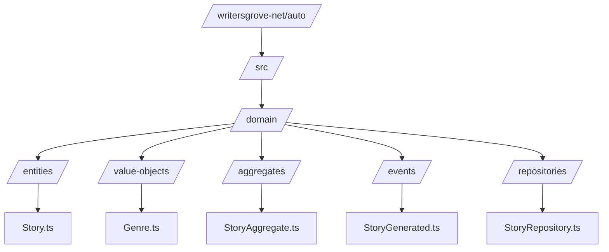
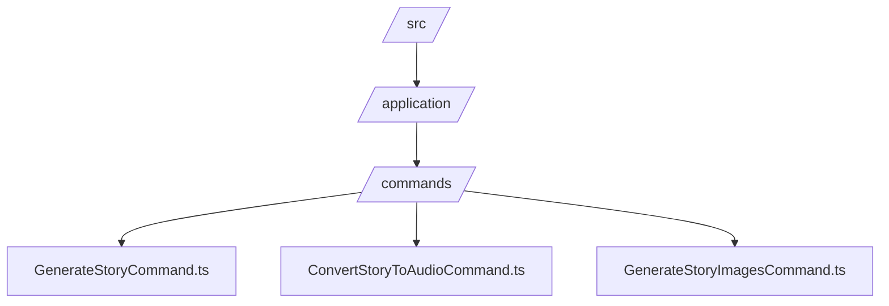
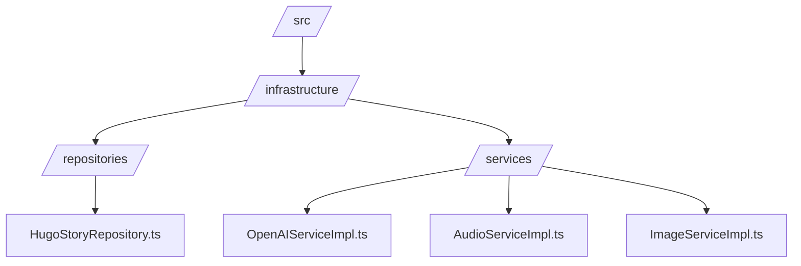
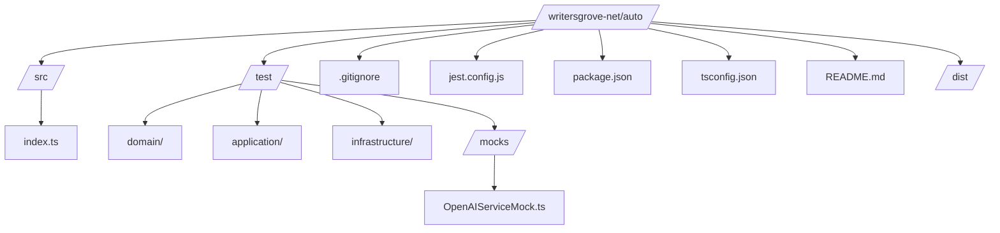

# autobotgo

Automatic LLM Generated Stories, PodCasts, and Videos in Go

## To Do

- [x] Setup http server to listen for external cron trigger
- [ ] Set up SQLite
- [ ] Setup Custom Github Runner
- [ ] Setup AWS CDK Deploy
  - [ ] EC2 Instance Deployment
  - [ ] Setup Amazon S3 Saves
  - [ ] Setup EC2 Secret Manager
- [ ] Deploy with git workflow on tag
- [ ] Select Random Genre
- [ ] Generate Story - Initially use Open AI
- [ ] Save Story to DB
- [ ] Generate images - Initially Use OpenAI
- [ ] Convert images from png to WebP
- [ ] save images to s3
- [ ] generate Audio - Initially use Open AI
- [ ] Save audio to s3
- [ ] Generate Video with FFMpeg (??)
- [ ] Save Video to S3
- [ ] Write Blog
- [ ] Upload Pod Cast
- [ ] Upload Video to Youtube
- [ ] Deploy own LLM for Story Generation
- [ ] Deploy own Image Generation
- [ ] Deploy own TTS for Audio Generation
- [ ] Look into other video generation methods

### Auto Story Generator Design

### Domain

### Commands

### Infrastructure

### Tests and other files

